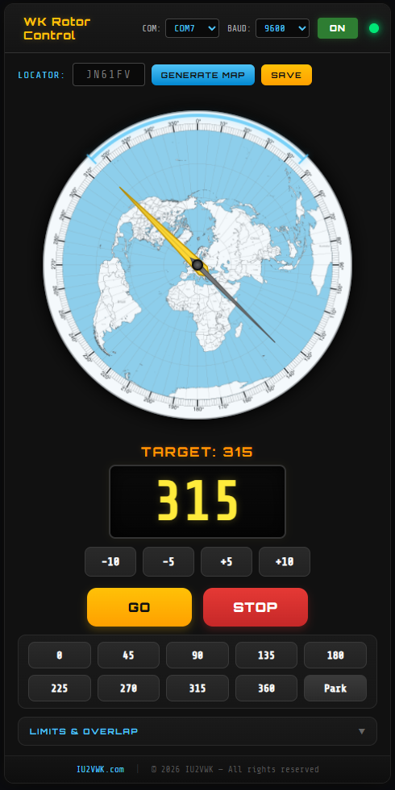

# WK Rotor Control

Universal antenna rotor controller for **Yaesu G-600** and compatible rotors (GS-232 protocol). Real-time azimuth compass with NS6T map generator, serial communication via Web Serial API (Windows) or pyserial bridge (macOS).

[](https://github.com/iu2vwk-ita/WK-Rotor-Control/actions/workflows/build.yml)
[](https://github.com/iu2vwk-ita/WK-Rotor-Control/releases/latest)



---

## Download

| Platform | File | Link |
|----------|------|------|
| **Windows** | `WKRotorControl.exe` | [Download](https://github.com/iu2vwk-ita/WK-Rotor-Control/releases/latest/download/WKRotorControl.exe) |
| **macOS** | `WKRotorControl-macOS.zip` | [Download](https://github.com/iu2vwk-ita/WK-Rotor-Control/releases/latest/download/WKRotorControl-macOS.zip) |

[All releases →](https://github.com/iu2vwk-ita/WK-Rotor-Control/releases)

### System Requirements

| Platform | Version | Runtime |
|----------|---------|---------|
| Windows | 10 / 11 | Edge WebView2 (pre-installed) |
| macOS | 12+ | WebKit (built-in) + pyserial |

---

## Features

- **Azimuthal Map Generator** — Generate high-resolution azimuthal projection maps centered on your QTH using NS6T data. Instant PDF → PNG conversion.
- **Real-time Compass Display** — Live heading readout with a rendered azimuth compass overlay atop your generated map.
- **GS-232 Serial Protocol** — Communicates directly with Yaesu G-600 and compatible rotors over USB serial.
- **Overlap Indicator** — Glowing blue arc on the compass shows the mechanical overlap zone (configurable 0°–360°).
- **Azimuth Sector Limits** — Restrict rotation to a user-defined sector. The rotor automatically routes around forbidden zones, visualized as a dashed red overlay.
- **Simulation Mode** — Full UI testable without hardware. A 50ms software timer simulates azimuth movement.
- **Cross-Platform** — Native desktop apps for Windows (WebView2) and macOS (WebKit + pyserial).
- **CI/CD Builds** — Every push builds both platforms automatically via GitHub Actions.

---

## Quick Start

### Windows (dev)
```bat
start.bat
```

### macOS (dev)
```bash
bash start_mac.sh
```

### Build from source
```bash
# Install dependencies
pip install -r requirements.txt

# Run
python app.py
```

---

## How It Works

1. **Enter Locator** — Input your Maidenhead grid locator (e.g. JN61fv)
2. **Generate Map** — Fetch azimuthal projection map from NS6T, rendered for your coordinates
3. **Control Antenna** — Use heading presets (0–315°) or manual entry to rotate your beam

---

## Repo Structure

```
├── app.py              # PyWebView launcher + serial bridge + NS6T maps
├── index.html          # Single-page UI
├── css/style.css       # Dark theme
├── js/app.js           # Canvas compass, display updates, events
├── js/rotor.js         # GS-232 protocol, simulation, Web Serial, Python serial
├── start.bat / start_mac.sh   # Dev launchers
├── build.bat / build_mac.sh   # PyInstaller build scripts
├── landing/            # Landing page (GitHub Pages)
└── .github/workflows/  # CI/CD: Windows + macOS builds on push
```

---

Built by [IU2VWK](https://iu2vwk.com)
